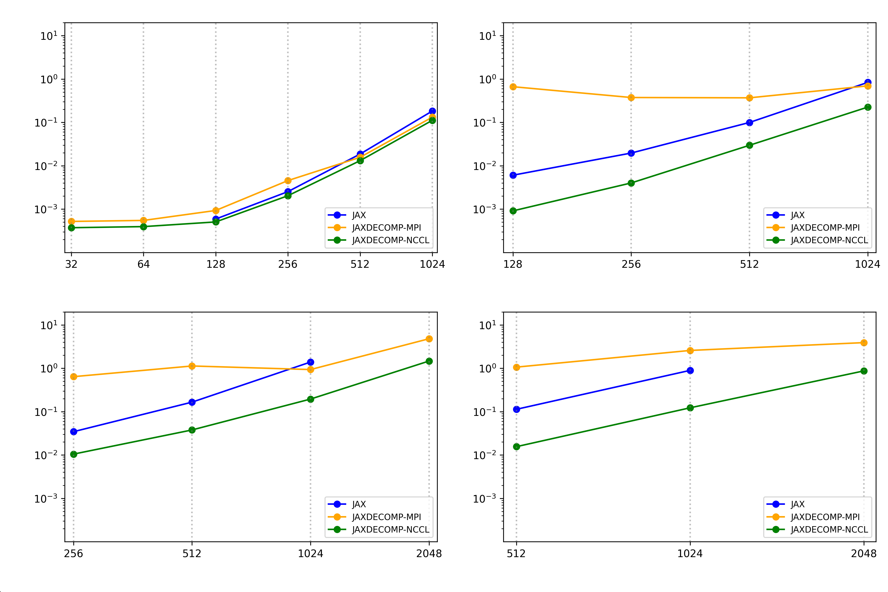

# Abstract

Cosmological simulations are key tools in understanding the distribution of galaxies and dark matter in the universe. Differentiable simulations provide access to gradients, significantly accelerating the inference process. Fast Particle Mesh (PM) simulations are excellent candidates due to their speed, simplicity, and inherent differentiability. However, as we enter the exascale era, simulation sizes are surpassing the maximum available memory, even for high-end HPC GPUs. Therefore, a multi-node distributed Particle Mesh simulation is necessary to simulate large cosmological volumes effectively.

The only step requiring communication in fast PM simulations is the fast Fourier transform (FFT). There are several implementations of distributed FFTs from the computer science community, such as [@2DECOMP&FFT], which allows distributed FFTs on CPUs, and the GPU implementation [@cuDecomp], which uses the NVIDIA Collective Communication Library (NCCL) for communication. However, these libraries do not provide differentiable 3D FFTs, which are essential for gradient-based monte-carlo sampling techniques like Hamiltonian Monte Carlo (HMC) and variational inference.

To address this, we introduce `jaxDecomp`, a `JAX` library based on `cuDecomp` that efficiently decomposes simulation data into 2D slices (pencils) to facilitate multi-node parallel and differentiable Fast Fourier Transforms (FFTs) and halo exchanges. It leverages the power of compiled code directly within `JAX` code. This library will enable the large-scale distribution of simulations on High Performance Computing (HPC) clusters and aims to integrate seamlessly with existing open-source simulation codes like `JaxPM` and [@pmwd].


# Statement of Need

Particle mesh simulations are essential for cosmological data analysis, particularly in full field inference. They simulate the large-scale structure of the universe and generate the likelihood of the data given the cosmological parameters. Given the high dimensionality of these simulations, advanced sampling techniques such as Hamiltonian Monte Carlo (HMC) and variational inference are required to efficiently explore the parameter space. Differentiable simulations are crucial in this context as they provide access to gradients, significantly accelerating the inference process.

To maximize the potential of particle mesh simulations, it is crucial to use a very fine grid, achieving high resolution of small-scale structures and a power spectrum close to that of hydrodynamical simulations. However, this fine grid significantly increases memory consumption. For instance, for a grid size of $4096^3$, the force vector field is about 1.5 TB. Ideally, computing and storing the vector field at each step can easily require 5 to 10 TB of memory, which is not feasible on a single GPU, even with high-end data center GPUs like the H100. Distributing the simulation across multiple GPUs and nodes is necessary to overcome this limitation. The only step requiring communication in fast PM simulations is the FFT. Using a 3D decomposition library like `cuDecomp` and integrating its functionality with `JAX` will allow us to perform distributed and differentiable 3D FFTs, enabling the simulation of large cosmological volumes on HPC clusters.

To perform these simulations efficiently on modern HPC clusters, distributed FFTs are required. `jaxDecomp` addresses this need by distributing FFTs across multiple GPUs and nodes, fully compatible with `JAX`. This capability not only facilitates high-performance simulation but also ensures that the FFT operations remain differentiable, crucial for incorporating gradient-based optimization techniques like backpropagation in machine learning frameworks integrated with `JAX`.

# Implementation

## Distributed FFTs

The implementation of `jaxDecomp` does a serie of 1D FFTs using `cuFFT` on the undistributed axis, followed a multi GPU transposition using `cuDecomp` on the newly transposed undistributed axis.\
Starting with a 2D decomposition, The X axis is not distributed, and the Y and Z axes are distributed across multiple GPUs. The 1D FFTs are performed on the X axis, and the transposition is done from a X pencil to a Y pencil. The transposed data is then distributed across the GPUs. The 1D FFTs are performed on the Y axis, and the same is carried out for the Z axis.

And inverse FFTs goes the other way around, by running a 1D inverse FFT on the Z axis, then transposing the data from a Z pencil to a Y pencil, and running a 1D inverse FFT on the Y axis, and finally transposing the data from a Y pencil to an X pencil and running a 1D inverse FFT on the X axis.

{width=40%}

At any point of the simulation, the data is distributed accross 2 dimensions, with the third dimension being undistributed. This allows us to store simulation data of any size on the GPUs, as long as the data fits in the combined memory of the GPUs.

## Distributed Halo Exchange

In a particle mesh simulation, we use the 3DFFT to estimate the force field acting on the particles. The force field is then interpolated to the particles, and the particles are moved accordingly. The particles that are close to the boundary of the local domain need to be updated using the data from the neighboring domains. This is done using a halo exchange operation. Where we pad each slice of the simulation then we perform a halo exchange operation to update the particles that are close to the boundary of the local domain.

{width=40%}


# Example

In this example, we show how to perform a distributed 3D FFT using `jaxDecomp` and `JAX`. The code snippet below demonstrates the initialization of the distributed mesh, the creation of the initial distributed tensor, and the execution of a distributed 3D FFT using `jaxDecomp`.

```python
import jax
import jaxdecomp

# Setup
master_key = jax.random.PRNGKey(42)
key = jax.random.split(master_key, size)[rank]
pdims = (2 , 2)
mesh_shape = [2048, 2048 , 2048]
halo_size = (256 , 256 , 0)

# Create computing mesgh
devices = mesh_utils.create_device_mesh(pdims)
mesh = Mesh(devices, axis_names=('y', 'z'))
sharding = jax.sharding.NamedSharding(mesh, P('z', 'y'))

### Create all initial distributed tensors ###
local_mesh_shape = [
    mesh_shape[0] // pdims[1], mesh_shape[1] // pdims[0], mesh_shape[2]
]

z = jax.make_array_from_single_device_arrays(
        shape=mesh_shape,
        sharding=sharding,
        arrays=[jax.random.normal(key, local_mesh_shape)])


@jax.jit
def step(z):
    with mesh:
        padding = ((halo_size[0] , halo_size[0]) , (halo_size[1] , halo_size[1]) , (0 , 0))
        k_array = jaxdecomp.fft.pfft3d(z).real
        k_array = k_array * 2 # element wise operation is distributed automatically by jax
        k_array = jaxdecomp.slice_pad(k_array , padding , pdims)
        k_array = jaxdecomp.halo_exchange(
                            k_array,
                            halo_extents=halo_size,
                            halo_periods=(True, True, True))
        k_array = jaxdecomp.slice_unpad(k_array , padding , pdims)

        return jaxdecomp.fft.ifft3d(k_array).real

z = step(z)

```

A more detailed example of a LPT simulation can be found in the [jaxdecomp_lpt](examples/jaxdecomp_lpt.py).


# Benchmark

We benchmarked the distributed FFTs using `jaxDecomp` on a V100s with 32GB of memory. We compared the performance of `jaxDecomp` with the base `JAX` implementation.\
At $2048^3$ resolution, the base `JAX` implementation could not fit the data on a single GPU, while `jaxDecomp` could fit the data on 4 GPUs.

{.center width=40%}

# Stability and releases

A lot of effort has been put into packaging and testing. We have a continuous integration pipeline that builds and uploads the package to PyPI on every commit. We also have a 100% code coverage tests covering all four functionalities (FFT, Halo, (un)padding, and transposition). The code has been tester on the Jean Zay supercomputer, and we have been able to run simulations up to 64 GPUs.

# Acknowledgements

This work was granted access to the HPC resources of IDRIS under the allocation 2024-AD011014949 made by GENCI.

We also acknowledge the SCIPOL project\footnote{\url{scipol.in2p3.fr}} funded by the European Research Council (ERC) under the European Union’s Horizon 2020 research and innovation program (PI: Josquin Errard, Grant agreement No. 101044073).

# References
