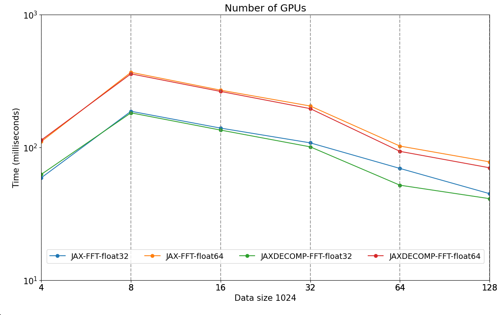
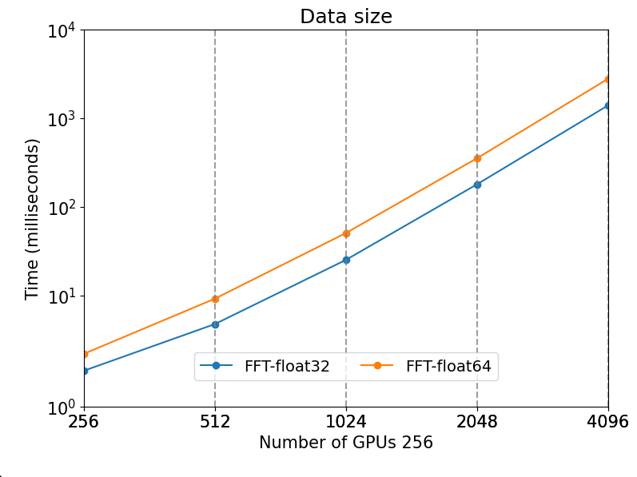
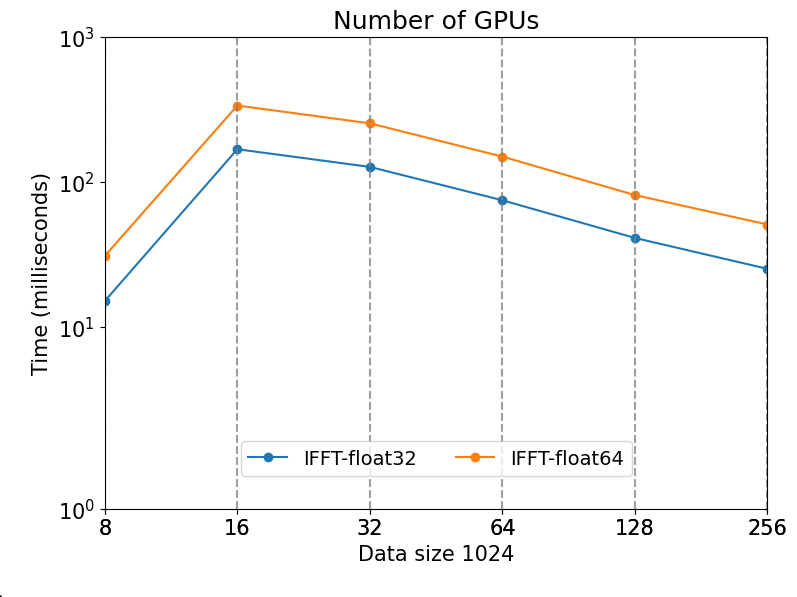
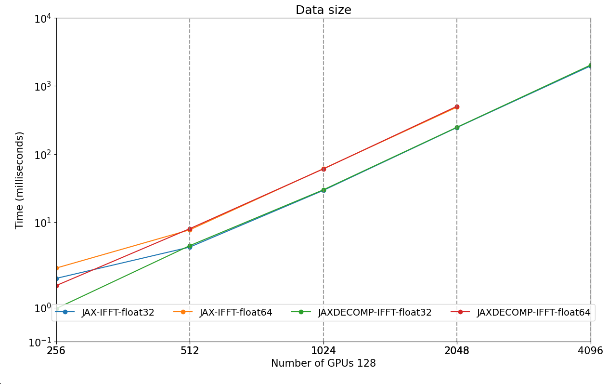

# Abstract

`JAX` [@JAX] has seen widespread adoption in both machine learning and scientific computing due to its flexibility and performance, as demonstrated in projects like `JAX-Cosmo` [@JAXCOSMO]. However, its application in distributed high-performance computing (HPC) has been limited by the complex nature of inter-GPU communications required in HPC scientific software, which is more challenging compared to deep learning networks. Previous solutions, such as `MPI4JAX` [@mpi4jax], provided support for single program multiple data (SPMD) operations but faced significant scaling limitations.

Recently, JAX has made a major push towards simplified SPMD programming, with the unification of the JAX array API and the introduction of several powerful APIs, such as `pjit`, `shard_map`, and `custom_partitioning`. However, not all native JAX operations have specialized distribution strategies, and `pjitting` a program can lead to excessive communication overhead for some operations, particularly the 3D Fast Fourier Transform (FFT), which is one of the most critical and widely used algorithms in scientific computing. Distributed FFTs are essential for many simulation and solvers, especially in fields like cosmology and fluid dynamics, where large-scale data processing is required.

To address these limitations, we introduce jaxDecomp, a JAX library that wraps NVIDIA's `cuDecomp` domain decomposition library [@cuDecomp]. jaxDecomp integrates specialized HPC code into the JAX ecosystem, providing JAX primitives with highly efficient CUDA implementations for key operations such as 3D FFTs and halo exchanges. By integrating seamlessly with JAX, jaxDecomp supports running on multiple GPUs and nodes, enabling large-scale, distributed scientific computations. Implemented as JAX primitives, jaxDecomp builds directly on top of the distributed Array strategy in JAX and is compatible with JAX transformations such as `jax.grad` and `jax.jit`, ensuring fast execution and differentiability with a Python, easy-to-use interface. Using cuDecomp, jaxDecomp can switch between `NCCL`, `CUDA-Aware MPI`, and `NVSHMEM` for distributed array transpose operations, allowing it to best fit the specific HPC cluster configuration.

In our benchmarks, jaxDecomp demonstrates significant performance improvements, offering a speedup of %XX over cuFFTMP, while being much more user-friendly. This makes it an ideal solution for researchers requiring both high performance and ease of use in distributed FFT operations within the JAX environment.


# Statement of Need

For numerical simulations on HPC systems, having a distributed, easy-to-use, and differentiable FFT is critical for achieving peak performance and scalability. While it is technically feasible to implement distributed FFTs using native JAX, for performance and memory-critical simulations, it is better to use specialized HPC codes. These codes, however, are not typically differentiable. The need for differentiable, performant, and memory-efficient code has risen due to the recent introduction of differentiable algorithms such as Hamiltonian Monte Carlo (HMC) [@HMC] and the No-U-Turn Sampler (NUTS) [@NUTS].

In scientific applications such as particle mesh (PM) simulations for cosmology, existing frameworks like `FlowPM` [@FlowPM], a `mesh-TensorFlow` [@TF-MESH] based simulation, are distributed but no longer actively maintained. Similarly, JAX-based frameworks like `pmwd` [@pmwd] are limited to 512 volumes due to the lack of distribution capabilities. These examples underscore the critical need for scalable and efficient solutions. jaxDecomp addresses this gap by enabling distributed and differentiable 3D FFTs within JAX, thereby facilitating the simulation of large cosmological volumes on HPC clusters effectively.

While it is technically feasible to implement distributed FFTs using native JAX, there are significant benefits to using jaxDecomp. Although the performance difference may be marginal, jaxDecomp offers several advantages that make it a valuable tool for HPC applications. Firstly, jaxDecomp provides the ability to easily switch backends between NCCL, MPI, and NVSHMEM, optimizing performance based on the specific HPC cluster configuration. Secondly, jaxDecomp performs operations in place, which is more memory-efficient, minimizing the use of intermediate memory and enhancing overall performance. This is crucial for memory-bound codes such as cosmological simulations.

# Implementation

## Distributed FFT Algorithm

The distributed FFT in `jaxDecomp` is performed by applying a series of 1D FFTs along each of the three axes of a 3D array: first along the Z-axis, then the Y-axis, and finally the X-axis. In the case of a distributed FFT, local FFTs are executed on the undistributed axis, while batched FFTs are performed on the distributed axes. In order to correctly apply the FFT along each axis, it is necessary to perform a series of transpositions to rearrange the data across the axes, aligning them for efficient computation.

### Data Transposition

To effectively implement the distributed FFT, the data must be transposed between each FFT operation, ensuring the correct alignment of the distributed and undistributed axes. These transpositions involve both local cyclic adjustments on each GPU and global communications across the processor grid.

The following table outlines the transposition steps involved in `jaxDecomp`, which rearranges the data to facilitate the distributed FFT process:

| Steps            | Operation Description                                                              |
|------------------|------------------------------------------------------------------------------------|
| FFT along Z      | Perform batched FFT along the Z-axis. The Z-axis is initially undistributed.        |
| Transpose Z to Y | Transpose to $Z \times X \times Y$. Distribute the Y-axis across available GPUs.    |
| FFT along Y      | Perform batched FFT along the Y-axis. The Y-axis is now undistributed.              |
| Transpose Y to X | Transpose to $Y \times Z \times X$. Distribute the X-axis across available GPUs.    |
| FFT along X      | Perform batched FFT along the X-axis. The X-axis is now undistributed.              |

### Domain Decomposition

Domain decomposition is a method used in parallel computing to break down large computational domains into smaller subdomains, facilitating efficient data distribution across multiple GPUs. In the context of 3D FFTs, domain decomposition and transpositions work together to manage the data, with transpositions gathering one axis while distributing another for the FFT.

In `jaxDecomp`, the X-axis always starts as undistributed, and the decomposition dimensions (pdims) are defined by the `P_y` and `P_z` parameters.

#### Pencil Decomposition

For pencils, we perform three 1D FFTs with a transpose between each one (two transpositions). The 1D FFT is done on the fastest axis, which is undistributed (X in X pencil, Y in Y pencil, etc.).

| Step               | Origin                                     | Target                                      |
|--------------------|--------------------------------------------|---------------------------------------------|
| Transpose Z to Y   | $\frac{X}{P_x} \times \frac{Y}{P_y} \times Z$ | $\frac{Z}{P_y} \times \frac{X}{P_x} \times Y$ |
| Transpose Y to X   | $\frac{Z}{P_y} \times \frac{X}{P_x} \times Y$ | $\frac{Y}{P_x} \times \frac{Z}{P_y} \times X$ |
| Transpose X to Y   | $\frac{Y}{P_x} \times \frac{Z}{P_y} \times X$ | $\frac{Z}{P_y} \times \frac{X}{P_x} \times Y$ |
| Transpose Y to Z   | $\frac{Z}{P_y} \times \frac{X}{P_x} \times Y$ | $\frac{X}{P_x} \times \frac{Y}{P_y} \times Z$ |

#### Slab Decomposition

For 1D decomposition (slabs), we need to perform one 1D FFT and one 2D FFT. 2D FFTs present additional challenges because both the fastest and the second fastest axes must remain undistributed.

For example, consider a $({P_y}, {P_z})$ decomposition with $P_z = 1$:

| Step             | Decomposition                      | FFT Feasibility          |
|------------------|------------------------------------|--------------------------|
| Initial          | $X \times \frac{Y}{P_y} \times Z$ | Can only do 1D FFT on Z   |
| Transpose Z to Y | $\frac{Z}{P_y} \times X \times Y$  | Can do 2D FFT on YX       |

This is the case for the YZ slab, where the transformation sequence enables the application of a 2D FFT on the YZ plane:

The function can be represented by:
$$
FFT(Z) \rightarrow TransposeZtoY \rightarrow FFT2D(YX)
$$

For the other decomposition, with $P_y = 1$ and $P_x = 4$:

| Step             | Decomposition                        | FFT Feasibility                       |
|------------------|--------------------------------------|---------------------------------------|
| Initial          | $\frac{X}{P_x} \times Y \times Z$     | Can do 1D FFT on Z or 2D FFT on YX      |
| Transpose Z to Y | $Z \times \frac{X}{P_x} \times Y$    | Can only do 1D FFT on Y (already done) |

To achieve an X pencil from a Z pencil in a single transposition, a coordinate transformation can be applied, effectively reinterpreting the axes from XYZ to YZX. This approach allows for slab decomposition with a single transposition step.

`cuDecomp` does not provide the possibility to go from the initial pencil backward; in other words, we cannot go from a Z pencil to an X pencil in a single transposition. This is why we need to use a coordinate transformation to achieve this.

#### Slab Decomposition with Coordinate Transformation

| Step               | Decomposition                      | Our Coordinates                      | Coordinate Step      | FFT Feasibility                        |
|--------------------|------------------------------------|--------------------------------------|----------------------|----------------------------------------|
| Initial            | $\frac{Z}{P_x} \times X \times Y$   | $\frac{X}{P_x} \times Y \times Z$     | -                    | Can do 2D FFT on ZY                     |
| Transpose Y to Z   | $X \times \frac{Y}{P_x} \times Z$  | $Y \times \frac{Z}{P_x} \times X$    | Transpose Z to X     | Can do 1D (I)FFT on the last axis X     |
| Transpose Z to Y   | $\frac{Z}{P_x} \times X \times Y$   | $\frac{X}{P_x} \times Y \times Z$     | Transpose X to Z     | Can do 2D IFFT on ZY                    |

This approach ensures that slab decomposition can be achieved in a single transposition step, enhancing computational efficiency.

The function can be represented by:
$$
FFT2D(ZY) \rightarrow TransposeZtoX \rightarrow FFT(X)
$$

### Non-Contiguous Global Transpose

`jaxDecomp` also supports non-contiguous transpositions, where the transposition is performed globally without requiring local transpositions. In this case, the `P_x` and `P_y` dimensions remain associated with their original axes throughout the process, maintaining the same axis order (`X`, `Y`, `Z`). This method is particularly useful for operations that need to preserve the global data layout while performing efficient distributed computations.

The following table illustrates the steps for a non-contiguous global transpose, where the `P_x` and `P_y` dimensions stay aligned with the `X`, `Y`, and `Z` axes, without any permutation:

| Step               | Origin                                     | Target                                      |
|--------------------|--------------------------------------------|---------------------------------------------|
| Z to Y   | $\frac{X}{P_x} \times \frac{Y}{P_y} \times Z$ |$\frac{X}{P_x} \times Y \times \frac{Z}{P_y}$  |
| Y to X   | $\frac{X}{P_x} \times Y \times \frac{Z}{P_y}$ |$X \times \frac{Y}{P_x} \times\frac{Z}{P_y}$  |
| X to Y   | $X \times \frac{Y}{P_x} \times\frac{Z}{P_y}$ | $\frac{X}{P_x} \times Y \times \frac{Z}{P_y}$  |
| Y to Z   |$\frac{X}{P_x} \times Y \times \frac{Z}{P_y}$   |  $\frac{X}{P_x} \times \frac{Y}{P_y} \times Z$  |

Our benchmarks did not show any significant performance difference between the contiguous and non-contiguous transpositions.

## Distributed Halo Exchange

The halo exchange is a crucial step in distributed programming. It allows the transfer of data on the edges of each slice to the adjacent slice, ensuring data consistency across the boundaries of distributed domains.

Many applications in high-performance computing (HPC) use domain decomposition to distribute the workload among different processing elements. These applications, such as cosmological simulations, stencil computations, and PDE solvers, require the halo regions to be updated with data from neighboring regions. This process, often referred to as a halo update, is implemented using MPI (Message Passing Interface) on large machines.

Using cuDecomp, we can also change the communication backend to `NCCL`, `MPI`, or `NVSHMEM`.

### Halo Exchange Process

For each axis, a slice of data of size equal to the halo extent is exchanged between neighboring subdomains.

| Send                                             | Receive                                               |
|--------------------------------------------------|-----------------------------------------------------|
| $[ \text{Size} - 2 \times \text{Halo extent} \rightarrow  extent\text{Size} - \text{Halo extent} ]$ is sent to the next  extentslice | $[ 0 \rightarrow \text{Halo extent} ]$ is received from the previous slice |
| $[ \text{Halo extent} \rightarrow 2 \times \text{Halo extent} ]$ is sent to the previous slice | $[  extent\text{Size} - \text{Halo extent} \rightarrow \text{Size} ]$ is received from the next slice |


### Efficient State Management in jaxDecomp

jaxDecomp effectively manages the metadata and resources required for cuDecomp operations, ensuring both efficiency and performance. This is achieved through a caching mechanism that stores the necessary information for transpositions and halo exchanges, as well as cuFFT plans.

jaxDecomp caches the metadata that cuDecomp uses for transpositions and halo exchanges, and also caches the cuFFT plans. All this data is created efficiently and lazily (i.e., it is generated only when needed during JAX's just-in-time (JIT) compilation of functions) and stored for subsequent use. This approach ensures that resources are allocated only when necessary, reducing overhead and improving performance.

The cached data is properly destroyed at the end of the session, ensuring that no resources are wasted or leaked.

Additionally, jaxDecomp opportunistically creates inverse FFT (IFFT) plans when the FFT is JIT compiled. This leads to improved performance, as the IFFT plans are readily available for use, resulting in a 5x speedup in the IFFT JIT compilation process.


# API description

In this description, we show how to perform a distributed 3D FFT using `jaxDecomp` and `JAX`. The code snippet below demonstrates the initialization of the distributed mesh, the creation of the initial distributed tensor, and the execution of a distributed 3D FFT using `jaxDecomp`.

```python
import jax
import jaxdecomp

# Setup
master_key = jax.random.PRNGKey(42)
key = jax.random.split(master_key, size)[rank]
pdims = (2 , 2)
mesh_shape = [2048, 2048 , 2048]
halo_size = (256 , 256 , 0)

# Create computing mesgh
devices = mesh_utils.create_device_mesh(pdims)
mesh = Mesh(devices, axis_names=('y', 'z'))
sharding = jax.sharding.NamedSharding(mesh, P('z', 'y'))

### Create all initial distributed tensors ###
local_mesh_shape = [
    mesh_shape[0] // pdims[1], mesh_shape[1] // pdims[0], mesh_shape[2]
]

z = jax.make_array_from_single_device_arrays(
        shape=mesh_shape,
        sharding=sharding,
        arrays=[jax.random.normal(key, local_mesh_shape)])


@jax.jit
def do_fft(z):
      k_array = jaxdecomp.fft.pfft3d(z)
      k_array = k_array * 2 # element wise operation is distributed automatically by jax
      r_array = jaxdecomp.fft.pifft3d(k_array).real
      return r_array


def do_halo_exchange(z):
    padding = ((halo_size[0] , halo_size[0]) , (halo_size[1] , halo_size[1]) , (0 , 0))
    z = jaxdecomp.slice_pad(k_array , padding , pdims)
    z = jaxdecomp.halo_exchange(
                        z,
                        halo_extents=(halo_size // 2 , halo_size // 2),
                        halo_periods=(True, True, True),
                        reduce_halo=True)
    z = jaxdecomp.slice_unpad(z , padding , pdims)
    return k_array

def do_transpose(x_pencil):
    y_pencil = jaxdecomp.transposeXtoY(x_pencil)
    z_pencil = jaxdecomp.transposeYtoZ(y_pencil)
    y_pencil = jaxdecomp.transposeZtoY(z_pencil)
    x_pencil = jaxdecomp.transposeYtoX(y_pencil)
    return x_pencil


with mesh:
    z = do_fft(z)
    z = do_halo_exchange(z)
    z = do_transpose(z)

```

### Benchmarks

The performance benchmarks for jaxDecomp were conducted on the Jean Zay supercomputer using the A100 GPUs (each with 80 GB of memory). These tests demonstrate the scalability and efficiency of jaxDecomp in handling large-scale FFT operations.

The tests show that jaxDecomp scales very well, even when distributed across multiple nodes, maintaining efficient performance. In particular, jaxDecomp demonstrates efficient computation as the number of GPUs and problem size increase.

We compare the performance of jaxDecomp with the native JAX FFT implementation, showing that jaxDecomp is slightly faster than the native JAX implementation, but also more memory efficient due to its in-place local transpositions and FFTs.


Strong scaling             |  Weak scaling
:-------------------------:|:-------------------------:
  |  
  |  


# Example

In the provided example, the code computes gravitational forces using a Particle-Mesh (PM) scheme within a JAX-based environment. The code can run on multiple GPUs and nodes using `jaxDecomp` and `JAX` while being fully differentiable.

This method is particularly relevant for particle mesh simulations, as demonstrated in the PMWD paper. The PMWD framework is designed to run on a single GPU, but it is limited to grid sizes of up to 512 due to its inability to scale beyond a single device.

```python
import jax
import jax.numpy as jnp
from jaxdecomp import pfft3d, ipfft3d

def pm_forces(density):
    delta_k = pfft3d(density)
    ky, kz, kx = [jnp.fft.fftfreq(s) * 2 * jnp.pi for s in density.shape]
    kk = kx**2 + ky**2 + kz**2
    laplace_kernel = jnp.where(kk == 0, 1., -1. / kk)
    pot_k = delta_k * laplace_kernel
    forces = [-ipfft3d(1j * k * pot_k) for k in [kx, ky, kz]]
    return jnp.stack(forces, axis=-1)
```

A more detailed example of an LPT simulation can be found in the [jaxdecomp_lpt](https://github.com/DifferentiableUniverseInitiative/jaxDecomp/blob/main/examples/lpt_nbody_demo.py).

Here is an example of an LPT density field:


# Stability and releases

A lot of effort has been put into packaging and testing. We aim to have a 100% code coverage tests covering all four functionalities (FFT, Halo, (un)padding, and transposition). The code has been tester on the Jean Zay supercomputer, and we have been able to run simulations up to 64 GPUs.
We also aim to package the code and release it on PyPI as built wheels for HPC clusters.

# Acknowledgements

This work was granted access to the HPC resources of IDRIS under the allocation 2024-AD011014949 made by GENCI. The computations in this work were, in part, run at facilities supported by the Scientific Computing Core at the Flatiron Institute, a division of the Simons Foundation.

We also acknowledge the SCIPOL scipol.in2p3.fr funded by the European Research Council (ERC) under the European Union’s Horizon 2020 research and innovation program (PI: Josquin Errard, Grant agreement No. 101044073).

# References
