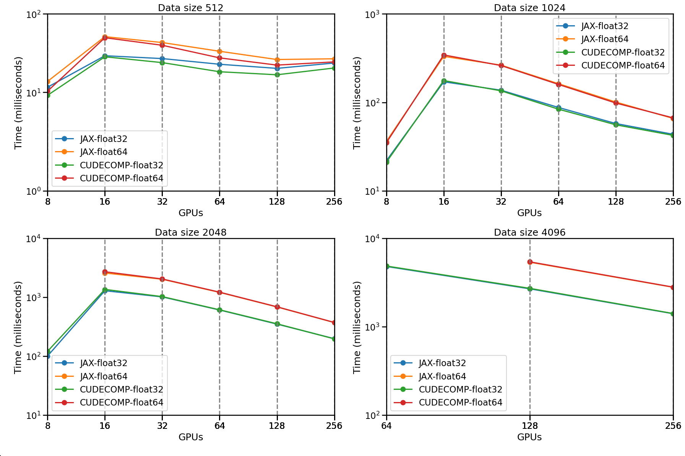

# Summary


`JAX` \[@JAX] has become a popular framework for machine learning and scientific computing, offering high performance, composability, and distributed computing. However, its use as a full HPC framework has been limited by partial native support for key distributed operations. Libraries like `MPI4JAX` \[@mpi4jax] enable large-scale parallelism but face limitations, notably buffer size constraints and incompatibility with native JAX distribution, making it hard to use with the JAX ecosystem.

The introduction of JAX’s unified array API and tools like `pjit` and `custom_partitioning` has made SPMD-style programming more accessible. However, many HPC workflows require specialized operations such as optimized distributed Fast Fourier Transforms (FFTs) or halo exchange operations.

To fill this gap, we present `jaxDecomp`, a fully differentiable JAX library for distributed 3D FFTs and halo exchanges. It wraps NVIDIA’s `cuDecomp` library \[@cuDecomp], exposing its functionality as JAX primitives while maintaining compatibility with JAX transformations like `jit` and `grad`. Beyond basic distributed FFTs, `jaxDecomp` provides halo exchange operations and automatic optimization of communication backends (NCCL, MPI, NVSHMEM) based on the target hardware. Benchmarks show competitive performance with native JAX while adding HPC-specific features.


# Statement of Need

For numerical simulations on HPC systems, a distributed, easy-to-use, and differentiable FFT is essential for achieving peak performance and scalability. While JAX now provides native distributed FFT support, this was introduced only very recently and lacks the specialized HPC features required by many applications. There is a pressing need for a solution that provides not only distributed FFTs but also halo exchanges, optimized communication backends, and seamless integration with existing cluster infrastructure.

In scientific applications such as cosmological particle mesh (PM) simulations, specialized frameworks like `FlowPM` \[@FlowPM] built on `mesh-TensorFlow` \[@TF-MESH] or JAX-based codes like `pmwd` \[@pmwd] often struggle to scale beyond single-node memory limits or rely on manual distribution strategies. These challenges highlight the need for a scalable, high-performance approach to distributed FFTs that remains differentiable for advanced algorithms (like Hamiltonian Monte Carlo \[@HMC] or the No-U-Turn Sampler (NUTS) \[@NUTS]).


# Implementation

## Distributed FFT Algorithm

`jaxDecomp` performs 3D FFTs by applying 1D FFTs along the Z, Y, and X axes, with global transpositions between steps to ensure each axis is locally accessible. This enables fully local computation while distributing the workload across devices.

The table below summarizes the FFT-transpose sequence:

| Steps            | Operation Description                                    |
|------------------|----------------------------------------------------------|
| FFT along Z      | Batched 1D FFT along the Z-axis.                         |
| Transpose Z to Y | Transpose to $Z \times X \times Y$. Partition the Y-axis |
| FFT along Y      | Batched 1D FFT along the Y-axis.                         |
| Transpose Y to X | Transpose to $Y \times Z \times X$. Partition the X-axis |
| FFT along X      | Batched 1D FFT along the X-axis.                         |

`jaxDecomp` uses pencil and slab decomposition schemes to distribute 3D data across GPUs. Each FFT step is followed by a transposition that reshapes and rebalances the array to align the next axis for local computation. More technical details, including decomposition strategies and axis layouts, are available in the [documentation](https://jaxdecomp.readthedocs.io/en/latest/02-decomposition.html).


## Distributed Halo Exchange

`jaxDecomp` includes efficient halo exchange operations required in stencil computations and PDE solvers. It supports multiple backends—`NCCL`, `MPI`, and `NVSHMEM`—to adapt to different cluster architectures and communication patterns. Details and visuals of the halo exchange logic are available in the [documentation](https://jaxdecomp.readthedocs.io/en/latest/04-halo_exchange.html).


# Benchmarks

Benchmarks were run on the Jean Zay supercomputer using NVIDIA A100 GPUs to evaluate strong and weak scaling of large 3D FFTs across nodes.

We benchmarked both backends in `jaxDecomp`; `cuDecomp` was slightly faster than native JAX, especially on large, multi-node workloads.


{ width=100% }

{ width=100% }


# Stability and releases

We aim for 100% test coverage across all core functionalities: FFT, halo exchange, and transposition. The code has been tested on the Jean Zay supercomputer, with simulations distributed on 64 GPUs. The package is available on PyPI and can be installed via `pip install jaxDecomp`.


## Contributing and Community

Contributions are welcome. The project follows clear guidelines and uses `yapf` and `pre-commit` for formatting. A full guide is available in the [repository’s `CONTRIBUTING.md`](https://github.com/DifferentiableUniverseInitiative/jaxDecomp/blob/main/CONTRIBUTING.md). Users and developers are invited to participate by opening issues, submitting pull requests, or joining discussions via GitHub.

# Acknowledgements

This work was granted access to the HPC resources of IDRIS under the allocation 2024-AD011014949 made by GENCI. The computations in this work were, in part, run at facilities supported by the Scientific Computing Core at the Flatiron Institute, a division of the Simons Foundation.

We also acknowledge the SCIPOL scipol.in2p3.fr funded by the European Research Council (ERC) under the European Union’s Horizon 2020 research and innovation program (PI: Josquin Errard, Grant agreement No. 101044073).


### Appendix

#### Particle-Mesh Example (PM Forces)

The following example computes gravitational forces using a Particle-Mesh (PM) scheme in a JAX-based setup, running on multiple GPUs with `jaxDecomp`.while remaining fully differentiable.


```python
import jax.numpy as jnp
import jaxdecomp

def pm_forces(density):
    # `density` is a 3D distributed array of shape (Nx, Ny, Nz) is defined over the simulation mesh distributed across (y, z) axes
    delta_k = jaxdecomp.fft.pfft3d(density)
    ky, kz, kx = jaxdecomp.fft.fftfreq3d(delta_k)
    kk = kx**2 + ky**2 + kz**2
    laplace_kernel = jnp.where(kk == 0, 1.0, -1.0 / kk)
    pot_k = delta_k * laplace_kernel
    forces = [-jaxdecomp.fft.pifft3d(1j * k * pot_k) for k in [kx, ky, kz]]
    return jnp.stack(forces, axis=-1)
```

A more detailed example of an LPT simulation can be found in the [jaxdecomp_lpt example](https://github.com/DifferentiableUniverseInitiative/jaxDecomp/blob/main/examples/lpt_nbody_demo.py).


{ width=65% }

I refer the reader to the full API description in the [jaxDecomp documentation](https://jaxdecomp.readthedocs.io/en/latest/01-basic_usage.html).

# References
