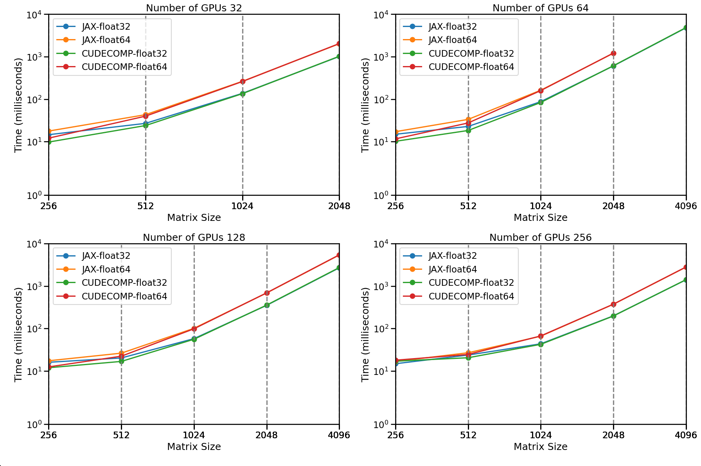

# Abstract


`JAX` [@JAX] has seen widespread adoption in both machine learning and scientific computing due to its flexibility and performance, as demonstrated in projects like `JAX-Cosmo` [@JAXCOSMO]. However, its application in distributed high-performance computing (HPC) has been limited by the complex nature of inter-GPU communications required in HPC scientific software, which is more challenging compared to deep learning networks. Previous solutions, such as `MPI4JAX` [@mpi4jax], provided support for single program multiple data (SPMD) operations but faced significant scaling limitations, partly due to the MPI protocol’s limitations in handling large messages (typically capped at 2–4 GB per buffer on many systems).

With the introduction of the unified JAX array API in JAX 0.4, along with powerful tools such as `pjit`, `shard_map`, and `custom_partitioning`, SPMD programming has become more accessible. Nonetheless, many NumPy and SciPy operators that *“work”* on distributed arrays will internally gather the entire array onto a single device, defeating the purpose of parallelizing large computations. This limitation is particularly problematic for the 3D Fast Fourier Transform (FFT), one of the most essential operations in scientific computing and a core component of large-scale simulations in fields like cosmology and fluid dynamics [@jax-md].

To address these challenges, we present **jaxDecomp**, a JAX library that wraps NVIDIA’s `cuDecomp` domain decomposition library [@cuDecomp] and also implements all operators as JAX primitives. jaxDecomp integrates specialized HPC code into the JAX ecosystem for key distributed operations, including 3D FFTs and halo exchanges. It scales seamlessly to multiple GPUs and nodes. By building on the distributed array strategy in JAX, it remains compatible with standard JAX transformations such as `jax.grad` and `jax.jit`, ensuring a Pythonic, differentiable interface. jaxDecomp can use NCCL, CUDA-Aware MPI, or NVSHMEM for inter-GPU data transposition, providing flexibility to match specific HPC cluster configurations.

In our benchmarks, jaxDecomp demonstrates strong performance while being trivial to install and use. In contrast, cuFFTMP requires more setup, does not support differentiability, and relies solely on NVSHMEM—which manages memory outside of XLA and thus does not interact as well with the JAX ecosystem. Consequently, jaxDecomp is an ideal solution for researchers requiring both high performance and ease of use in distributed FFT operations within the JAX environment.


# Statement of Need

For numerical simulations on HPC systems, a distributed, easy-to-use, and differentiable FFT is essential for achieving peak performance and scalability. There is a pressing need for a solution that can serve as a true drop-in replacement for `jnp.fft` and install seamlessly—especially for HPC users who must integrate efficiently with existing cluster infrastructure.

In scientific applications such as cosmological particle mesh (PM) simulations, specialized frameworks like `FlowPM` [@FlowPM] (built on `mesh-TensorFlow` [@TF-MESH]) or JAX-based codes like `pmwd` [@pmwd] often struggle to scale beyond single-node memory limits or rely on manual distribution strategies. These challenges highlight the need for a scalable, high-performance approach to distributed FFTs that remains differentiable for advanced algorithms (e.g., Hamiltonian Monte Carlo [@HMC] and the No-U-Turn Sampler (NUTS) [@NUTS]).

jaxDecomp fills this gap by offering a lightweight JAX library that wraps NVIDIA’s `cuDecomp` for distributed 3D FFTs, halo exchanges, and related operations, all implemented as fully differentiable JAX primitives. This seamless approach lets users transparently switch between NCCL, MPI, or NVSHMEM backends, optimizing performance for the specific setup of each HPC cluster. As a result, jaxDecomp simplifies large-scale simulation workflows and eliminates the need to manually implement distributed FFTs in JAX, while preserving memory efficiency, compatibility with JAX transformations, and ease of use.


# Implementation

## Distributed FFT Algorithm

The distributed FFT in `jaxDecomp` is performed by applying a series of 1D FFTs along each of the three axes of a 3D array: first along the Z-axis, then the Y-axis, and finally the X-axis. Local 1D FFTs are performed along the axis that is currently undistributed, while global transpositions are used to realign the data so that each axis becomes undistributed in turn. This sequence ensures that each FFT operates locally, with global transpositions enabling the redistribution of data between steps.

### Data Transposition

To effectively implement the distributed FFT, the data must be transposed between each FFT operation, ensuring the correct alignment of the distributed and undistributed axes. These transpositions involve both local cyclic adjustments on each GPU and global communications across the processor grid.

The following table outlines the transposition steps involved in `jaxDecomp`, which rearranges the data to facilitate the distributed FFT process:


| Steps            | Operation Description                                    |
|------------------|----------------------------------------------------------|
| FFT along Z      | Batched 1D FFT along the Z-axis.                         |
| Transpose Z to Y | Transpose to $Z \times X \times Y$. Partition the Y-axis |
| FFT along Y      | Batched 1D FFT along the Y-axis.                         |
| Transpose Y to X | Transpose to $Y \times Z \times X$. Partition the X-axis |
| FFT along X      | Batched 1D FFT along the X-axis.                         |


### Domain Decomposition

Domain decomposition is a method used in parallel computing to break down large computational domains into smaller subdomains, facilitating efficient data distribution across multiple GPUs. In the context of 3D FFTs, domain decomposition and transpositions work together to manage the data, with transpositions gathering one axis while distributing another for the FFT.

In `jaxDecomp`, the Z-axis always starts as undistributed, and the decomposition dimensions (pdims) are defined by the `P_x` and `P_y` parameters.

#### Pencil Decomposition

In pencil decomposition, the 3D FFT is computed via three sequential 1D FFTs, each separated by a transposition that redistributes the data to align the next undistributed axis. The 1D FFT is performed on the fastest (inner-most) axis, which is undistributed at that stage of the algorithm (e.g., X in X-pencil, Y in Y-pencil, etc.).

| Step             | Origin     | Target      |
|----------------------|-----------------------------------------------|------------------------------------------|
| Transpose Z to Y | $\frac{X}{P_x} \times \frac{Y}{P_y} \times Z$| $\frac{Z}{P_y} \times \frac{X}{P_x} \times Y$ |
| Transpose Y to X | $\frac{Z}{P_y} \times \frac{X}{P_x} \times Y$| $\frac{Y}{P_x} \times \frac{Z}{P_y} \times X$ |
| Transpose X to Y | $\frac{Y}{P_x} \times \frac{Z}{P_y} \times X$| $\frac{Z}{P_y} \times \frac{X}{P_x} \times Y$ |
| Transpose Y to Z | $\frac{Z}{P_y} \times \frac{X}{P_x} \times Y$| $\frac{X}{P_x} \times \frac{Y}{P_y} \times Z$ |

#### Slab Decomposition

For 1D decomposition (slabs), we need to perform one 1D FFT and one 2D FFT. 2D FFTs present additional challenges because both the fastest and second-fastest axes must remain undistributed.

For example, consider a $(P_y, P_z)$ decomposition with $P_z = 1$:

| Step            | Decomposition                     | FFT Feasibility                 |
|-----------------|-----------------------------------|---------------------------------|
| Initial         | $X \times \frac{Y}{P_y} \times Z$  | Can only do 1D FFT on Z        |
| Transpose Z to Y| $\frac{Z}{P_y} \times X \times Y$  | Can do 2D FFT on YX            |

This is the case for the YZ slab, where the transformation sequence enables the application of a 2D FFT on the YX plane:

FFT2D($YX$) $\rightarrow$ TransposeYtoX $\rightarrow$ FFT($X$)

For the other decomposition, with $P_y = 1$ and $P_x = 4$:

| Step             | Decomposition                        | FFT Feasibility                       |
|------------------|-----------------|--------|
| Initial         | $\frac{X}{P_x} \times Y \times Z$ | Can do 1D FFT on Z or 2D FFT on YX     |
| Transpose Z to Y| $Z \times \frac{X}{P_x} \times Y$ | Can only do 1D FFT on Y (already done) |

To achieve an X pencil from a Z pencil in a single transposition, a coordinate transformation can be applied, effectively reinterpreting the axes from XYZ to YZX. This approach allows for slab decomposition with a single transposition step.

cuDecomp does not support a direct transposition from a Z pencil to an X pencil. To achieve this, a coordinate transformation is required to reinterpret the axes.

#### Slab Decomposition with Coordinate Transformation

| Step               | Decomposition                        | Our Coordinates                          | Coordinate Step      | FFT Feasibility                        |
|--------------------|--------------------------------------|------------------------------------------|----------------------|----------------------------------------|
| Initial            | $\frac{Z}{P_x} \times X \times Y$     | $\frac{X}{P_x} \times Y \times Z$       | –                    | Can do 2D FFT on ZY                    |
| Transpose Y to Z   | $X \times \frac{Y}{P_x} \times Z$     | $Y \times \frac{Z}{P_x} \times X$       | Transpose Z to X     | Can do 1D (I)FFT on the last axis X     |
| Transpose Z to Y   | $\frac{Z}{P_x} \times X \times Y$     | $\frac{X}{P_x} \times Y \times Z$       | Transpose X to Z     | Can do 2D IFFT on ZY                   |

This approach ensures that slab decomposition can be achieved in a single transposition step, enhancing computational efficiency.


FFT2D($ZY$) $\rightarrow$ TransposeZtoX $\rightarrow$ FFT($X$)

### Non-Contiguous Global Transpose

`jaxDecomp` also supports non-contiguous transpositions, where the transposition is performed globally across devices, without requiring intermediate local reshuffling on each GPU. In this case, the `P_x` and `P_y` dimensions remain associated with their original axes throughout the process, maintaining the same axis order (`X`, `Y`, `Z`). This method is particularly useful in workflows that benefit from preserving the global logical layout of the array, such as halo exchanges or certain stencil-based computations.

The following table illustrates the steps for a non-contiguous global transpose, where the `P_x` and `P_y` dimensions stay aligned with the `X`, `Y`, and `Z` axes, without any permutation:

| Step       | Origin                                       | Target                                         |
|------------|----------------------------------------------|------------------------------------------------|
| Z to Y     | $\frac{X}{P_x} \times \frac{Y}{P_y} \times Z$ | $\frac{X}{P_x} \times Y \times \frac{Z}{P_y}$   |
| Y to X     | $\frac{X}{P_x} \times Y \times \frac{Z}{P_y}$ | $X \times \frac{Y}{P_x} \times \frac{Z}{P_y}$   |
| X to Y     | $X \times \frac{Y}{P_x} \times \frac{Z}{P_y}$ | $\frac{X}{P_x} \times Y \times \frac{Z}{P_y}$   |
| Y to Z     | $\frac{X}{P_x} \times Y \times \frac{Z}{P_y}$ | $\frac{X}{P_x} \times \frac{Y}{P_y} \times Z$   |

Our benchmarks did not show any significant performance difference between the contiguous and non-contiguous transpositions. As a result, non-contiguous transposes can simplify implementation without compromising performance.


## Distributed Halo Exchange

The halo exchange is a crucial step in distributed programming. It allows the transfer of data on the edges of each slice to the adjacent slice, ensuring data consistency across the boundaries of distributed domains.

Many applications in high-performance computing (HPC) use domain decomposition to distribute the workload among different processing elements. These applications, such as cosmological simulations, stencil computations, and PDE solvers, require the halo regions to be updated with data from neighboring regions. This process, often referred to as a halo update, is implemented using MPI (Message Passing Interface) on large machines.

Using cuDecomp, we can also change the communication backend to `NCCL`, `MPI`, or `NVSHMEM`.

### Halo Exchange Process

For each axis, `jaxDecomp` performs a bidirectional halo exchange, where a slice of width equal to the halo extent is exchanged with adjacent subdomains. This ensures that each subdomain has access to the necessary boundary data from its neighbors.

The following table shows the index ranges involved in each send and receive operation:

| Direction            | Sent Range (from current slice)                | Received Range (into current slice)                |
|----------------------|------------------------------------------------|----------------------------------------------------|
| To next neighbor     | $[\text{Size} - 2 \cdot h : \text{Size} - h]$  | $[0 : h]$ (from previous neighbor)                 |
| To previous neighbor | $[h : 2 \cdot h]$                               | $[\text{Size} - h : \text{Size}]$ (from next neighbor) |

Where :

    - $h$ is the **halo extent**
    - `Size` is the local size of the array along the axis


### Efficient State Management in jaxDecomp

jaxDecomp effectively manages the metadata and resources required for cuDecomp operations, ensuring both efficiency and performance. This is achieved through a caching mechanism that stores the necessary information for transpositions and halo exchanges, as well as cuFFT plans.

jaxDecomp caches the metadata that cuDecomp uses for transpositions and halo exchanges, and also caches the cuFFT plans. All this data is created efficiently and lazily (i.e., it is generated only when needed during JAX's just-in-time (JIT) compilation of functions) and stored for subsequent use. This approach ensures that resources are allocated only when necessary, reducing overhead and improving performance.

The cached data is properly destroyed at the end of the session, ensuring that no resources are wasted or leaked.

Additionally, jaxDecomp opportunistically creates inverse FFT (IFFT) plans when the FFT is JIT compiled. This leads to improved performance, as the IFFT plans are readily available for use, resulting in a 5x speedup in the IFFT JIT compilation process.


### Benchmarks

The performance benchmarks for `jaxDecomp` were conducted on the Jean Zay supercomputer using NVIDIA A100 GPUs (each with 80 GB of memory). These tests evaluated both strong and weak scaling of large-scale 3D FFT operations across multiple nodes.

We benchmarked both backends available in `jaxDecomp`: the cuDecomp-based implementation and a pure JAX-based backend. The benchmarks indicate that `cuDecomp` is slightly faster than native JAX, particularly for large, multi-node workloads.
{ width=100% }

{ width=100% }


# Stability and releases

A lot of effort has been put into packaging and testing. We aim to have a 100% code coverage tests covering all four functionalities (FFT, Halo, (un)padding, and transposition). The code has been tester on the Jean Zay supercomputer, and we have been able to run simulations up to 64 GPUs.
We also aim to package the code and release it on PyPI as built wheels for HPC clusters.

# Acknowledgements

This work was granted access to the HPC resources of IDRIS under the allocation 2024-AD011014949 made by GENCI. The computations in this work were, in part, run at facilities supported by the Scientific Computing Core at the Flatiron Institute, a division of the Simons Foundation.

We also acknowledge the SCIPOL scipol.in2p3.fr funded by the European Research Council (ERC) under the European Union’s Horizon 2020 research and innovation program (PI: Josquin Errard, Grant agreement No. 101044073).


### Appendix

Detailed examples demonstrating the usage of `jaxDecomp` are provided in the appendix:

- **Appendix A**: Performing a distributed 3D FFT with `jaxDecomp`
- **Appendix B**: Particle-Mesh (PM) simulation example using distributed FFTs


## Appendix A: API description

In this description, we show how to perform a distributed 3D FFT using `jaxDecomp` and `JAX`. The code snippet below demonstrates the initialization of the distributed mesh, the creation of the initial distributed tensor, and the execution of a distributed 3D FFT using `jaxDecomp`.

```python
import jax
import jaxdecomp

# Setup
master_key = jax.random.PRNGKey(42)
key = jax.random.split(master_key, size)[rank]
pdims = (2 , 2)
mesh_shape = [2048, 2048, 2048]
halo_size = (256 , 256)

# Create computing mesgh
devices = mesh_utils.create_device_mesh(pdims)
mesh = Mesh(devices, axis_names=('y', 'z'))
sharding = jax.sharding.NamedSharding(mesh, P('z', 'y'))

### Create all initial distributed tensors
local_mesh_shape = [
    mesh_shape[0] // pdims[1], mesh_shape[1] // pdims[0], mesh_shape[2]
]

z = jax.make_array_from_single_device_arrays(
        shape=mesh_shape,
        sharding=sharding,
        arrays=[jax.random.normal(key, local_mesh_shape)])


@jax.jit
def do_fft(z):
      k_array = jaxdecomp.fft.pfft3d(z)
      k_array = k_array * 2 # element wise operation is distributed automatically by jax
      r_array = jaxdecomp.fft.pifft3d(k_array).real
      return r_array


def do_halo_exchange(z):
    z = jaxdecomp.halo_exchange(
                        z,
                        halo_extents=(halo_size // 2 , halo_size // 2),
                        halo_periods=(True, True),
                        reduce_halo=True)
    return k_array

def do_transpose(x_pencil):
    y_pencil = jaxdecomp.transposeXtoY(x_pencil)
    z_pencil = jaxdecomp.transposeYtoZ(y_pencil)
    y_pencil = jaxdecomp.transposeZtoY(z_pencil)
    x_pencil = jaxdecomp.transposeYtoX(y_pencil)
    return x_pencil


  z = do_fft(z)
  z = do_halo_exchange(z)
  z = do_transpose(z)

```

# Appendix B: Particle-Mesh Example (PM Forces)

In the following example, the code computes gravitational forces using a Particle-Mesh (PM) scheme within a JAX-based environment. The code can run on multiple GPUs and nodes using `jaxDecomp` and `JAX` while remaining fully differentiable.

This method is particularly relevant for particle-mesh simulations, as demonstrated in the PMWD paper. The PMWD framework is designed to run on a single GPU, but it is limited to grid sizes of up to 512 due to its inability to scale beyond a single device.

```python
import jax
import jax.numpy as jnp
from jaxdecomp import pfft3d, ipfft3d , fftfreq3d

def pm_forces(density):
    delta_k = pfft3d(density)
    ky, kz, kx = fftfreq3d(delta_k)
    kk = kx**2 + ky**2 + kz**2
    laplace_kernel = jnp.where(kk == 0, 1., -1. / kk)
    pot_k = delta_k * laplace_kernel
    forces = [-ipfft3d(1j * k * pot_k) for k in [kx, ky, kz]]
    return jnp.stack(forces, axis=-1)
```

A more detailed example of an LPT simulation can be found in the [jaxdecomp_lpt example](https://github.com/DifferentiableUniverseInitiative/jaxDecomp/blob/main/examples/lpt_nbody_demo.py).


{ width=65% }


# References
